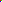

In this post I'll demonstrate how to load a bitmap into the memory and then print it's properties to the console. The code sample I use is quite rudimentary. However, I believe it is a good starting point to explore bitmaps in more depth.

## BMP file format

BMP is the most common format for representing bitmaps. Every BMP file contains two main sections:
- a file header
- a pixel array

The **header** contains general information about the bitmap image such as the size, the format or the offset (which is used to determine where does the pixel array start). The header always precedes the pixel data.

In order to represent the header I used a struct and applied alignment directives (`#pragma pack(push, 1)`, `#pragma pack(pop)` and `__attribute__((packed))`). The directives allow me to read the header directly to this struct, setting it's members properly (since the compiler won't insert paddings between them).
```c
#if _WIN32
    #pragma pack(push, 1)
#endif
    typedef struct
    {
        char headerField[2];
        unsigned int bitmapSize;
        char reserved[4];
        unsigned int offset;
        unsigned int headerSize;
        int bitmapWidth;
        int bitmapHeight;
        unsigned short colorPlaneCount;
        unsigned short bitsPerPixel;
        unsigned int compressionMethod;
        unsigned int imageSize;
        int horizontalResolution;
        int verticalResolution;
        unsigned int colorPaletteColorCount;
        unsigned int importantColors;        
    }
#if __APPLE__ 
    __attribute__((packed)) BitmapHeader;
#elif _WIN32
    BitmapHeader;
    #pragma pack(pop)
```
 
The **pixel array** as it's name indicates is just an array of data which represents the image in a format (specified by the header). Our sample code supports 32-bit bitmaps (ARGB32), which means that for each pixel 4 byte of information is used.

```c
typedef union 
{
   unsigned int value;
   struct
   {
       unsigned char b;
       unsigned char g;
       unsigned char r;
       unsigned char a;
   };
} Color32;
```
Using an union lets me access the individual color channels (blue, green, red, alpha) which can be quite handy in some situations. Like when you want to alter only the transparency of the color.

There is also a struct for the pixel array. Which looks like this:

```c
typedef struct
{
    Color32* pixels;
    unsigned int w;
    unsigned int h;
} PixelArray32;
```
The first member is a pointer to a memory location where the pixels start. While w and h represent the width and the height of the image respectively. For a more detailed discussion of the BMP format please visit the dedicated [wikipedia](https://en.wikipedia.org/wiki/BMP_file_format) page.


## Accessing the pixel data

Once the header is loaded we know how big the image supposed to be and what the offset is. So we can allocate memory and read the file accordingly. 

```c
if (fseek(file, header->offset, SEEK_SET) == 0)
{
    if (header->bitsPerPixel == 32)
    {
        pixelArray->h = header->bitmapHeight;
        pixelArray->w = header->bitmapWidth;
        pixelArray->pixels = (Color32*) GetMemory(buffer, header->imageSize);

        if (header->imageSize == fread(pixelArray->pixels, 1, header->imageSize, file))
        {
            fclose(file);
            return SUCCESS;
        }
    }
    else
    {
        fclose(file);
        return UNSUPPORTED_FORMAT;
    }
}
```

This is just a fragment from the BMP reading code where we `fseek()` to reposition the file stream to where the pixel array starts. Then `GetMemory()` is called which returns a memory chunk with the requested size. And finally, the pixels are read to this buffer.

In order to test the program I used an image in which the color values are quite unambiguous (pure red, green, blue and white).



For this image the program outputs the lines below:

```
Height: 2  Width: 2 
Image size: 16, 
Bits per pixel: 32 
Compression: 3 Huffman 1D 
Pixel[1][0] = rgba(000, 000, 255, 255) 
Pixel[1][1] = rgba(255, 255, 255, 255) 
Pixel[0][0] = rgba(255, 000, 000, 255) 
Pixel[0][1] = rgba(000, 255, 000, 255)
```

Usually pixels are stored "bottom-up", starting in the left corner. That why it is printed to the console in this order.

The full version of the code is available [here](https://github.com/LosoncziTamas/c-playground/tree/master/misc/bitmap).

---